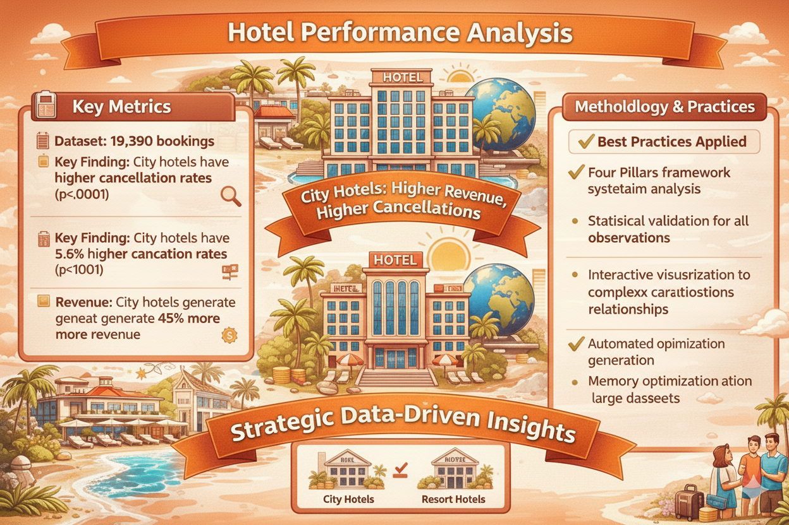

  

# 🔍 دليل التحليل الاستكشافي الشامل للبيانات (EDA)
## منهجية الأعمدة الأربعة – Four Pillars Approach

---

## 📊 نبذة عن التقرير

يقدم هذا التقرير تحليلًا استكشافيًا شاملًا للبيانات (**Exploratory Data Analysis – EDA**) باستخدام إطار احترافي يُعرف باسم **منهجية الأعمدة الأربعة**.  
يهدف إلى تحويل بيانات حجوزات الفنادق الخام إلى **رؤى قابلة للتنفيذ** تدعم اتخاذ القرار، مع التركيز على:

- فهم سلوك العملاء
- تحليل معدلات الإلغاء
- تحديد مصادر الإيرادات

تم تنفيذ التحليل على مجموعة بيانات تضم **119,390 سجل حجز** باستخدام أدوات بايثون الشائعة في علم البيانات:

- Pandas  
- Matplotlib  
- Seaborn  
- Plotly  

🎯 يستهدف هذا التقرير المحللين من **المستوى المبتدئ إلى المتوسط** بأسلوب تعليمي وتطبيقي في الوقت نفسه.

---

# 🧱 منهجية التحليل: الأعمدة الأربعة لـ EDA

يعتمد التقرير على إطار تحليلي منظم يتكون من أربعة أعمدة رئيسية:

---

## 1️⃣ تكوين البيانات (Data Composition)

**السؤال الأساسي:** ما الذي تحتويه البيانات؟

- فهم عدد السجلات والمتغيرات  
- تحديد أنواع البيانات (رقمية، فئوية، زمنية)  
- اكتشاف القيم المفقودة والمكررة  
- تقييم جودة البيانات  

---

## 2️⃣ توزيع البيانات (Data Distribution)

**السؤال الأساسي:** كيف تتوزع القيم داخل البيانات؟

- تحليل التوزيعات الإحصائية  
- اكتشاف القيم الشاذة (Outliers)  
- فهم سلوك الأسعار وعدد الليالي  
- استخدام الرسوم البيانية لتوضيح الأنماط  

---

## 3️⃣ العلاقات بين المتغيرات (Data Relationships)

**السؤال الأساسي:** كيف تتفاعل المتغيرات مع بعضها؟

- تحليل الارتباطات  
- دراسة العلاقة بين الإلغاء والسعر ومدة الإقامة  
- استخدام مصفوفات الارتباط  
- تصورات تفاعلية للعلاقات المعقدة  

---

## 4️⃣ المقارنة بين المجموعات (Data Comparison)

**السؤال الأساسي:** ما الفرق بين الفئات المختلفة؟

- مقارنة أداء الفنادق (City vs Resort)  
- تحليل الإيرادات ومعدلات الإلغاء  
- التحقق الإحصائي للنتائج  

---

# 📈 الملخص التنفيذي للتحليل (EDA Executive Summary)

## 🏨 بيانات التحليل

- **إجمالي الحجوزات:** 119,390  

---

## 🔍 أبرز النتائج

- الفنادق داخل المدن تسجل معدل إلغاء أعلى بنسبة **5.4%**  
- تم التحقق إحصائيًا من النتيجة بقيمة دلالة:  
  **p < 0.001**

---

## 💰 الإيرادات

- الفنادق داخل المدن تحقق إيرادات أعلى بنسبة **45%** مقارنة بالفنادق السياحية

---

# 🎯 أهداف التقرير

يهدف هذا التقرير إلى:

- تطبيق منهجية منظمة واحترافية في الـ EDA  
- اكتشاف الأنماط الخفية والعلاقات المؤثرة  
- دعم اتخاذ القرار بالبيانات  
- تطوير مهارات Data Storytelling  
- التدريب على أدوات التصور الحديثة  

---

# 🚀 أبرز مخرجات التحليل

- تحديد الفروقات الجوهرية بين أنواع الفنادق  
- فهم عوامل إلغاء الحجوزات  
- تحليل مصادر الإيرادات  
- رؤى مدعومة إحصائيًا  
- تصورات تفاعلية  
- تفسير العلاقات المعقدة بصريًا  

---

# 💡 القيمة المضافة من التقرير

- إطار تحليلي قابل لإعادة الاستخدام  
- دمج الإحصاء مع التصور البصري  
- تقليل مخاطر القرارات الحدسية  
- رفع مستوى عمق التحليل  
- تحسين التعامل مع البيانات الكبيرة  

